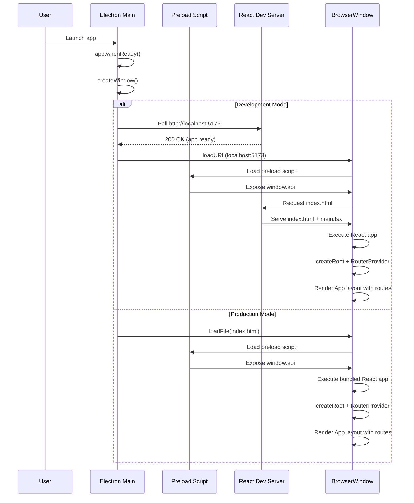
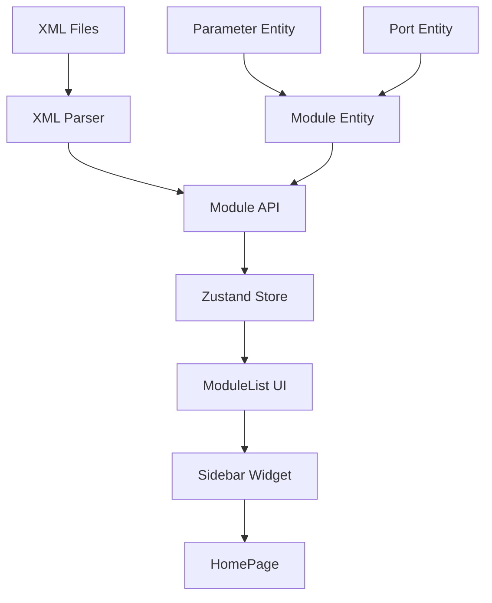
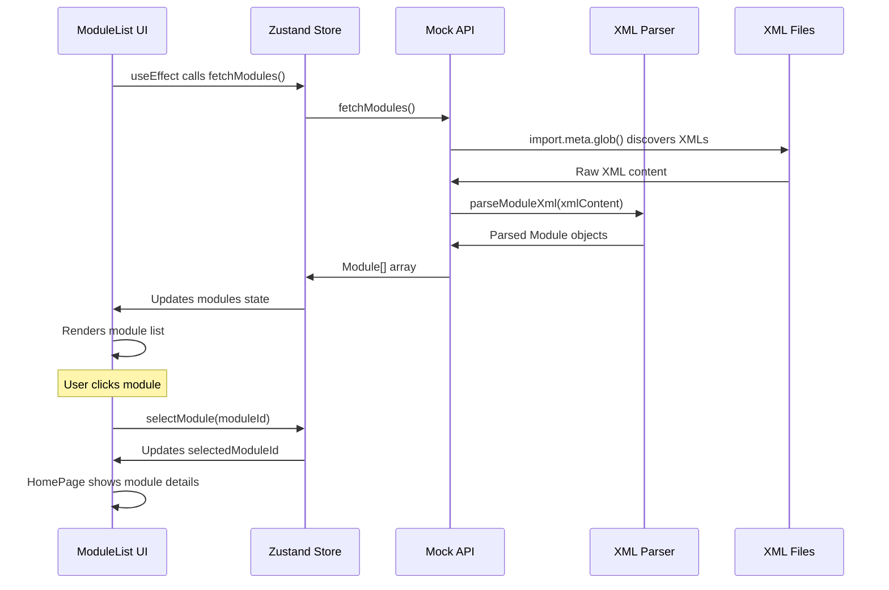

# AudioReach Creator - Implementation Guide

## Table of Contents

1. [App Loading and Rendering Flow](#app-loading-and-rendering-flow)
2. [Module-List Feature Implementation](#module-list-feature-implementation)
3. [Architecture Overview](#architecture-overview)
4. [Key Implementation Patterns](#key-implementation-patterns)

---

## App Loading and Rendering Flow

### Overview

AudioReach Creator is a hybrid desktop application built with Electron and React, following a monorepo structure with multiple packages for separation of concerns.

### 1. Electron Main Process Initialization

**File**: `packages/electron-app/src/main.ts`

The app starts with the Electron main process:

#### App Startup Process:

- `app.whenReady()` triggers the `createWindow()` function
- Creates a `BrowserWindow` with specific dimensions (800x1200 in production, 800x1550 in dev)
- Sets the preload script path to `./preload.cjs`
- Removes the default menu bar

#### Development vs Production Loading:

**Development Mode** (`process.env.DEV` is true):

- Waits for the React dev server at `http://localhost:5173`
- Uses a polling mechanism (120 attempts, 500ms intervals) to check if the React app is ready
- Once ready, loads the URL and opens DevTools
- If the React app doesn't start within 60 seconds, exits with an error

**Production Mode**:

- Directly loads a local `index.html` file from the `__dirname`

#### IPC Communication Setup:

- Sets up an IPC handler (`ipc::message`) for communication between Electron and React
- Handles different request types: `Request1`, `Request2`, and `CamelCase`
- Uses the `@audioreach-creator-ui/api-utils` package for type-safe communication

### 2. Preload Script Bridge

**File**: `packages/electron-app/src/preload.ts`

The preload script acts as a secure bridge between the Electron main process and the renderer (React app):

```typescript
const api: ElectronApi = {
  send: (request: any): Promise<ApiResponse> => {
    return ipcRenderer.invoke("ipc::message", request)
  },
  versions: {
    chromeVersion: () => process.versions.chrome || "",
    electronVersion: () => process.versions.electron || "",
    nodeVersion: () => process.versions.node || "",
  },
}

contextBridge.exposeInMainWorld("api", api)
```

- Exposes a safe API to the renderer via `contextBridge.exposeInMainWorld("api", api)`
- Provides methods for IPC communication and version information
- This API becomes available as `window.api` in the React app

### 3. React App Entry Point & Routing System

#### Main Entry Point

**File**: `packages/react-app/src/main.tsx`

The React application initialization:

```typescript
import {routes} from "@generouted/react-router"
import {createRoot} from "react-dom/client"
import {createHashRouter, RouterProvider} from "react-router-dom"

import "./index.css"

const router = createHashRouter(routes, {basename: "/"})
const Routes = () => <RouterProvider router={router} />

createRoot(document.getElementById("root")!).render(<Routes />)
```

**Key responsibilities**:

- **Router Setup**: Uses `@generouted/react-router` for file-based routing
- **Hash Router**: Creates a `HashRouter` (important for Electron apps to avoid file:// protocol issues)
- **Route Generation**: Routes are automatically generated from the `pages/` directory structure
- **DOM Rendering**: Uses React 18's `createRoot` API to render the router into the DOM element with id "root"

#### Root Layout Component

**File**: `packages/react-app/src/pages/_app.tsx`

The root layout component that wraps all pages:

```typescript
import {Outlet} from "react-router-dom"
import {QuiRoot} from "@qui/react"
import {Footer, Navbar, SideNav} from "~shared/layout"

export default function App() {
  return (
    <QuiRoot>
      <div className="flex flex-1 flex-col">
        <Navbar />
        <div className="flex w-full flex-1">
          <SideNav />
          <div className="main-content">
            <Outlet />
          </div>
        </div>
        <Footer />
      </div>
    </QuiRoot>
  )
}
```

**Key responsibilities**:

- **Root Layout**: Provides the common layout structure for all pages
- **UI Library Wrapper**: Uses `QuiRoot` to initialize the QUI design system
- **Navigation Structure**: Includes `Navbar`, `SideNav`, and `Footer` components
- **Page Outlet**: Uses `<Outlet />` from React Router to render the current page content

#### Relationship Between main.tsx and \_app.tsx

The relationship between these files follows the file-based routing pattern:

1. **`main.tsx`** is the application entry point that:
   - Creates the router using routes generated by `@generouted`
   - Renders the `RouterProvider` into the DOM

2. **`_app.tsx`** is a special file in the `pages/` directory that:
   - Acts as the root layout component for all routes
   - Is automatically recognized by `@generouted` as the app shell
   - Wraps all page components with common layout elements

3. **Route Resolution Flow**:

   ```
   main.tsx → RouterProvider → _app.tsx (root layout) → <Outlet /> → Current Page Component
   ```

4. **File-based Routing Convention**:
   - `_app.tsx` = Root layout (wraps all pages)
   - `index.tsx` = Home page (/)
   - `example/index.tsx` = Example page (/example)
   - `example/nested/index.tsx` = Nested page (/example/nested)

#### How index.tsx Relates to \_app.tsx

**File**: `packages/react-app/src/pages/index.tsx`

The `index.tsx` file is a specific page component that gets rendered within the `_app.tsx` layout:

```typescript
export default function HomePage(): ReactNode {
  const {modules, selectedModuleId} = useModuleListStore()
  const selectedModule = modules.find(
    (module) => module.id === selectedModuleId,
  )

  return (
    <div className="flex h-full w-full">
      <Sidebar />
      <div className="max-h-[calc(100vh-150px)] flex-1 overflow-auto pl-4">
        {selectedModule ? (
          <QCard className="w-full">
            {/* Module details display */}
          </QCard>
        ) : (
          <div className="q-font-heading-xl flex h-full items-center justify-center">
            <p>Select a module from the sidebar to view details</p>
          </div>
        )}
      </div>
    </div>
  )
}
```

**Relationship Breakdown**:

1. **`_app.tsx`** provides the **outer shell** with:
   - `QuiRoot` wrapper
   - `Navbar` at the top
   - `SideNav` on the left
   - `Footer` at the bottom
   - `<Outlet />` where page content renders

2. **`index.tsx`** provides the **page-specific content** that renders inside the `<Outlet />`:
   - Module list sidebar (note: this creates a nested sidebar within the layout's SideNav)
   - Module details display area
   - State management for module selection

**Rendering Hierarchy**:

```
_app.tsx (Root Layout)
├── QuiRoot
├── Navbar
├── SideNav (from layout)
├── <Outlet /> ← index.tsx renders here
│   └── HomePage Component
│       ├── Sidebar (module-specific)
│       └── Module Details Area
└── Footer
```

**Important Note**: The `index.tsx` component includes its own `<Sidebar />` component, which creates a nested sidebar structure. This means when viewing the home page, users see:

- The main application `SideNav` (from `_app.tsx`)
- The module-specific `Sidebar` (from `index.tsx`)

This design allows for page-specific navigation while maintaining the overall application layout structure.

### 4. HTML Template

**File**: `packages/react-app/index.html`

The base HTML template:

- Contains a `<div id="root"></div>` where React mounts
- Includes Google Fonts (Roboto Flex)
- Has a module script tag that loads `./src/main.tsx`
- Sets up basic meta tags and title

### 4. Routing System Architecture

The application uses a sophisticated file-based routing system where:

- **`main.tsx`** bootstraps the React application and router
- **`_app.tsx`** provides the persistent layout across all routes
- **Individual page files** render specific content within the layout

This creates a clean separation where:

- Layout concerns (navigation, sidebar, footer) are handled in `_app.tsx`
- Page-specific content is rendered through the `<Outlet />` component
- The router automatically maps file paths to URL routes

### 6. Complete Loading Sequence



---

## Module-List Feature Implementation

### Architecture Overview

The module-list feature follows a **Feature-Sliced Design (FSD)** architecture pattern, organizing code into layers: entities, features, widgets, and pages.



### 1. Data Layer (Entities)

#### Module Entity

**File**: `packages/react-app/src/entities/module/model/module.ts`

```typescript
export interface Module {
  description: string
  displayName: string
  id: string
  inputPorts: Port[]
  isBuiltin: boolean
  name: string
  outputPorts: Port[]
  parameters: Parameter[]
}
```

The module entity defines the core data structure with:

- Basic module information (id, name, displayName, description)
- Port information for audio routing
- Parameters for module configuration
- Built-in flag to distinguish system vs custom modules

#### Supporting Entities

- **Port**: Defines input/output connection points
- **Parameter**: Defines configurable module parameters

### 2. Data Source & Parsing

#### XML Data Source

- Module definitions are stored as XML files in `/src/assets/module_xmls/`
- Examples: `codec_dma_api.xml`, `mbdrc_api.xml`, `sal_api.xml`, etc.
- These contain AudioReach module specifications

#### XML Parser

**File**: `packages/react-app/src/shared/lib/xml-parser/index.ts`

Uses `fast-xml-parser` library for XML processing with key features:

```typescript
export const parseModuleXml = (xmlContent: string): Module[] => {
  const parser = new XMLParser({
    attributeNamePrefix: "",
    ignoreAttributes: false,
    isArray: (name) => {
      if (name === "MODULE") {
        return true
      }
      return false
    },
  })
  // ... parsing logic
}
```

**Key parsing features**:

- **Hex value normalization**: Converts hex values to uppercase format
- **Description sanitization**: Removes escape characters and formatting markers
- **Port parsing**: Extracts input/output port definitions
- **Parameter parsing**: Processes module parameters, filtering out sub-structures

#### Mock API

**File**: `packages/react-app/src/entities/module/api/mockModuleApi.ts`

```typescript
const moduleXmlFiles = import.meta.glob("/src/assets/module_xmls/*.xml", {
  as: "raw",
})

export const fetchModules = async (): Promise<Module[]> => {
  const moduleArrays = await Promise.all(
    Object.entries(moduleXmlFiles).map(async ([path, importFn]) => {
      const xmlContent = await importFn()
      return parseModuleXml(xmlContent)
    }),
  )
  return moduleArrays.flat()
}
```

- Uses Vite's `import.meta.glob()` to automatically discover XML files
- Processes all XML files in parallel using `Promise.all()`
- Returns flattened array of parsed modules

### 3. State Management (Zustand Store)

**File**: `packages/react-app/src/features/module-list/model/module-list-store.ts`

```typescript
interface ModuleListState {
  modules: Module[]
  isLoading: boolean
  error: string | null
  selectedModuleId: string | null

  // Actions
  fetchModules: () => Promise<void>
  selectModule: (id: string | null) => void
}

export const useModuleListStore = create<ModuleListState>((set) => ({
  // ... implementation
  fetchModules: async () => {
    set({error: null, isLoading: true})
    try {
      const modules = await fetchModules()
      setTimeout(() => {
        set({isLoading: false, modules})
      }, 1000) // Artificial delay for UX
    } catch (error) {
      set({
        error:
          error instanceof Error ? error.message : "Failed to fetch modules",
        isLoading: false,
      })
    }
  },
  // ...
}))
```

**Key Features**:

- **Async data fetching** with loading states and error handling
- **Module selection** state management
- **Artificial delay** (1 second) to demonstrate loading states
- **Error boundaries** with try-catch and user-friendly error messages

### 4. UI Components

#### ModuleList Component

**File**: `packages/react-app/src/features/module-list/ui/ModuleList.tsx`

```typescript
export const ModuleList: React.FC = () => {
  const {error, fetchModules, isLoading, modules, selectModule} =
    useModuleListStore()

  useEffect(() => {
    fetchModules()
  }, [fetchModules])

  if (isLoading) {
    return (
      <div className="grid h-[full] grid-rows-2 items-center justify-items-center">
        <QStatus
          color="informative"
          icon={Loader}
          kind="badge"
          label="Loading Module List ..."
          size="m"
        />
        <QProgressCircle size="l" />
      </div>
    )
  }

  // ... error and success states
}
```

**UI Features**:

- **Loading State**: Shows spinner and status badge during data fetch
- **Error State**: Displays user-friendly error messages
- **Empty State**: Handles case when no modules are found
- **Module List**: Renders scrollable list using QUI components
- **Module Selection**: Handles click events to select modules

#### Sidebar Widget

**File**: `packages/react-app/src/widgets/sidebar/ui/Sidebar.tsx`

```typescript
export const Sidebar: React.FC = () => {
  return (
    <QCard className="h-full w-[300px]">
      <QCardContent className="overflow-auto">
        <ModuleList />
      </QCardContent>
    </QCard>
  )
}
```

- Wraps ModuleList in a fixed-width (300px) card container
- Provides scrollable content area
- Acts as a reusable widget

### 5. Integration Points

#### HomePage Integration

**File**: `packages/react-app/src/pages/index.tsx`

```typescript
export default function HomePage(): ReactNode {
  const {modules, selectedModuleId} = useModuleListStore()
  const selectedModule = modules.find(
    (module) => module.id === selectedModuleId,
  )

  return (
    <div className="flex h-full w-full">
      <Sidebar />
      <div className="max-h-[calc(100vh-150px)] flex-1 overflow-auto pl-4">
        {selectedModule ? (
          <QCard className="w-full">
            {/* Module details display */}
          </QCard>
        ) : (
          <div className="q-font-heading-xl flex h-full items-center justify-center">
            <p>Select a module from the sidebar to view details</p>
          </div>
        )}
      </div>
    </div>
  )
}
```

- **Two-panel layout**: Sidebar + Main content area
- **Shared state**: Uses the same Zustand store to access selected module
- **Detail view**: Shows comprehensive module information when selected
- **Responsive design**: Handles overflow and scrolling

### 6. Data Flow



---

## Architecture Overview

### Project Structure

```
packages/
├── electron-app/           # Electron main process
│   └── src/
│       ├── main.ts        # App initialization
│       └── preload.ts     # IPC bridge
├── react-app/             # React frontend
│   └── src/
│       ├── entities/      # Business entities
│       ├── features/      # Business features
│       ├── widgets/       # UI compositions
│       ├── pages/         # Route components
│       └── shared/        # Shared utilities
└── api-utils/             # Shared API types
```

### Key Technologies

- **Electron**: Desktop app wrapper
- **React 18**: UI framework with createRoot API
- **React Router**: File-based routing with @generouted
- **Zustand**: Lightweight state management
- **TypeScript**: Type safety throughout
- **Vite**: Build tool and dev server
- **QUI React**: Design system components
- **fast-xml-parser**: XML processing
- **Lucide React**: Icon library

---

## Key Implementation Patterns

### 1. Feature-Sliced Design (FSD)

- **Entities**: Core business logic (Module, Parameter, Port)
- **Features**: Business features (module-list)
- **Widgets**: UI compositions (Sidebar)
- **Pages**: Route-level components (HomePage)

### 2. State Management Patterns

- Zustand for lightweight, TypeScript-friendly state management
- Separation of data fetching logic from UI components
- Centralized error handling and loading states

### 3. Data Processing Patterns

- Automatic file discovery using Vite's glob imports
- Parallel processing of multiple XML files
- Robust error handling at each parsing stage

### 4. UI/UX Patterns

- Loading states with progress indicators
- Error boundaries with user-friendly messages
- Empty states for better user experience
- Master-detail pattern (list + detail view)

### 5. Security Patterns

- Secure IPC communication through preload scripts
- Context isolation between main and renderer processes
- Type-safe API contracts

### 6. Scalability Considerations

- **Modular architecture**: Easy to add new module types or data sources
- **Type safety**: Full TypeScript coverage for data structures
- **Performance**: Parallel XML processing and efficient state updates
- **Extensibility**: Easy to add filtering, searching, or sorting capabilities
- **Reusability**: Widget-based architecture allows component reuse

---

## Conclusion

The AudioReach Creator application demonstrates a well-architected approach to building hybrid desktop applications with:

1. **Clear separation of concerns** between Electron and React layers
2. **Type-safe communication** between processes
3. **Scalable feature architecture** using FSD principles
4. **Robust data processing** with error handling and loading states
5. **Modern React patterns** with hooks and functional components
6. **Performance considerations** with parallel processing and efficient state management

This implementation serves as a solid foundation for building complex desktop applications that require both native desktop integration and modern web UI capabilities.
