# Git Workflow Quick Reference

A quick reference guide for the AudioReach Creator git workflow with feature branch protection and common commands.

## 🚀 Quick Start

```bash
# Setup (run once)
./scripts/setup-git.sh  # Linux/macOS
# OR
scripts\setup-git.bat   # Windows

# Daily workflow for feature branch development
git fetch origin                    # Get latest changes
git rebase origin/feature/your-feature  # Sync with feature branch
git st                             # Check status
git lg                             # View commit history
```

### Complete Git Aliases Reference

The setup script configures these aliases for efficient workflow:

```bash
# Rebase shortcuts
git rb      # rebase
git rbi     # rebase -i (interactive)
git rbc     # rebase --continue
git rba     # rebase --abort

# Status and log
git st      # status
git lg      # log --oneline --graph --decorate
git lga     # log --oneline --graph --decorate --all

# Branch management
git co      # checkout
git cob     # checkout -b (new branch)
git br      # branch
git brd     # branch -d (delete)

# Safe operations
git pushf   # push --force-with-lease
git sync    # checkout main && pull && checkout - && rebase main
```

## 📋 Common Workflows

### Three-Tier Branching Strategy

Our workflow uses a three-tier approach for feature development:

```mermaid
gitGraph
    commit id: "Initial"
    branch feature/open-file
    checkout feature/open-file
    commit id: "Feature base"
    
    branch satyak/file-dialog
    checkout satyak/file-dialog
    commit id: "Satyak: File dialog"
    commit id: "Satyak: Basic validation"
    
    checkout feature/open-file
    branch priya/ui-components
    checkout priya/ui-components
    commit id: "Priya: Button components"
    
    checkout feature/open-file
    branch alex/error-handling
    checkout alex/error-handling
    commit id: "Alex: Error types"
    
    checkout feature/open-file
    merge satyak/file-dialog
    commit id: "✅ Merge Satyak"
    
    checkout satyak/file-dialog
    checkout feature/open-file
    branch satyak/file-filters
    checkout satyak/file-filters
    commit id: "🔄 Satyak: New task"
    commit id: "Satyak: File filters"
    
    checkout priya/ui-components
    merge feature/open-file
    commit id: "🔄 Priya syncs"
    commit id: "Priya: Enhanced UI"
    
    checkout feature/open-file
    merge priya/ui-components
    commit id: "✅ Merge Priya"
    
    checkout alex/error-handling
    merge feature/open-file
    commit id: "🔄 Alex syncs"
    commit id: "Alex: Error messages"
    
    checkout satyak/file-filters
    merge feature/open-file
    commit id: "🔄 Satyak syncs"
    commit id: "Satyak: Filter logic"
    
    checkout feature/open-file
    merge alex/error-handling
    commit id: "✅ Merge Alex"
    
    checkout feature/open-file
    merge satyak/file-filters
    commit id: "✅ Merge Satyak v2"
    commit id: "Feature complete"
    
    checkout main
    merge feature/open-file
    commit id: "🚀 Feature to main"
```



### Starting Work on a Feature Branch

```bash
# 1. Always start from the latest feature branch
git checkout feature/open-file
git pull origin feature/open-file

# 2. Create your developer branch
git checkout -b satyak/file-validation
# OR use alias
git cob priya/ui-enhancements

# 3. Start development
# Make your changes...
git add .
git commit  # Uses template from .gitmessage
```

### Creating Developer Branches

Developer branches can use flexible naming but must target the feature branch:

```bash
# Acceptable patterns:
satyak/open-file          # username/feature
priya/file-dialog-ui      # username/component
alex/custom-branch        # username/anything
team-lead/open-file-v2    # role/feature
experimental/new-approach # scope/description

# Key rule: All merge to feature/open-file only, not main
```

### Feature Branch Lifecycle


## 📅 Daily Development

### Event-Driven Syncing Strategy

Sync with the feature branch whenever someone's PR gets merged:

```bash
# When notified: "PR merged to feature/open-file"
git fetch origin
git rebase origin/feature/open-file  # Maintains linear history
# Resolve conflicts if any (see conflict resolution section)
git pushf origin your-branch-name
```

### Handling Feature Branch Updates

```bash
# Check what changed in feature branch
git fetch origin
git log --oneline your-branch..origin/feature/open-file

# Rebase your work on top of latest feature branch
git rebase origin/feature/open-file

# If conflicts occur, resolve them (see detailed guide below)
# Then continue
git rbc  # rebase --continue

# Safe force push
git pushf origin your-branch-name
```

### Pre-PR Preparation

```bash
# 1. Final sync with feature branch
git fetch origin
git rebase origin/feature/open-file

# 2. Clean up commit history
git rbi HEAD~3  # Interactive rebase for last 3 commits

# Options in interactive rebase:
# pick   - keep commit as-is
# reword - change commit message  
# squash - combine with previous commit
# drop   - remove commit

# 3. Push and create PR to feature branch (not main!)
git pushf origin your-branch-name
```

## 🔥 Merge Conflict Resolution

### Scenario: Handling Conflicts While Maintaining Linear History

**Setup**: Both Priya and Satyak modify the same files. Satyak's PR gets merged first, creating conflicts for Priya.

```mermaid
gitGraph
    commit id: "Feature base"
    branch feature/open-file
    checkout feature/open-file
    commit id: "Initial setup"
    
    branch satyak/file-validation
    checkout satyak/file-validation
    commit id: "Satyak: FileDialog.tsx v1"
    commit id: "Satyak: utils.ts helpers"
    commit id: "Satyak: validation logic"
    
    checkout feature/open-file
    branch priya/ui-enhancements
    checkout priya/ui-enhancements
    commit id: "Priya: FileDialog.tsx styling"
    commit id: "Priya: utils.ts formatting"
    commit id: "Priya: accessibility features"
    
    checkout feature/open-file
    merge satyak/file-validation
    commit id: "✅ Satyak merged FIRST"
    
    checkout priya/ui-enhancements
    commit id: "❌ Priya: more changes (conflicts ahead!)"
    
    checkout priya/ui-enhancements
    merge feature/open-file
    commit id: "🔄 CONFLICT! Priya rebases"
    commit id: "✅ Conflicts resolved"
    commit id: "Priya: final touches"
    
    checkout feature/open-file
    merge priya/ui-enhancements
    commit id: "✅ Priya merged cleanly"
```



### Step-by-Step Conflict Resolution Process

#### Phase 1: Detection & Assessment
```bash
# Priya gets notification: "Satyak's PR merged to feature/open-file"
# Time to sync and resolve conflicts

# 1. Fetch latest changes
git fetch origin

# 2. Check what changed (optional but helpful)
git log --oneline feature/open-file..origin/feature/open-file
# Shows: "Satyak: validation logic", "Satyak: utils.ts helpers", etc.

# 3. Attempt rebase (this will reveal conflicts)
git rebase origin/feature/open-file
```

#### Phase 2: Conflict Resolution
```bash
# Git will stop and show conflicts:
# CONFLICT (content): Merge conflict in src/FileDialog.tsx
# CONFLICT (content): Merge conflict in src/utils.ts

# 4. Check conflict status
git st
# Shows:
# both modified:   src/FileDialog.tsx
# both modified:   src/utils.ts

# 5. Examine conflicts in each file
git diff src/FileDialog.tsx
```

**Example Conflict in FileDialog.tsx:**
```typescript
// FileDialog.tsx - Conflict markers
const FileDialog = () => {
<<<<<<< HEAD (Priya's changes)
  const [selectedFile, setSelectedFile] = useState<File | null>(null);
  const [isAccessible, setIsAccessible] = useState(true);
  
  const handleFileSelect = (file: File) => {
    setSelectedFile(file);
    // Priya's accessibility logic
    announceToScreenReader(`File ${file.name} selected`);
  };
=======
  const [selectedFile, setSelectedFile] = useState<File | null>(null);
  const [isValid, setIsValid] = useState(false);
  
  const handleFileSelect = (file: File) => {
    setSelectedFile(file);
    // Satyak's validation logic
    setIsValid(validateFile(file));
  };
>>>>>>> origin/feature/open-file (Satyak's changes)
  
  return (
    // ... rest of component
  );
};
```

#### Phase 3: Smart Resolution Strategy
```bash
# 6. Resolve conflicts by combining both approaches
# Edit FileDialog.tsx to merge both features:
```

**Resolved FileDialog.tsx:**
```typescript
const FileDialog = () => {
  const [selectedFile, setSelectedFile] = useState<File | null>(null);
  const [isValid, setIsValid] = useState(false);        // Satyak's feature
  const [isAccessible, setIsAccessible] = useState(true); // Priya's feature
  
  const handleFileSelect = (file: File) => {
    setSelectedFile(file);
    // Combine both features
    setIsValid(validateFile(file));                     // Satyak's validation
    announceToScreenReader(`File ${file.name} selected`); // Priya's accessibility
  };
  
  return (
    // ... rest of component
  );
};
```

#### Phase 4: Complete Resolution
```bash
# 7. Stage resolved files
git add src/FileDialog.tsx
git add src/utils.ts

# 8. Continue rebase
git rbc  # rebase --continue

# 9. If more conflicts exist, repeat steps 5-8
# If no more conflicts, rebase completes successfully

# 10. Verify the result
git lg -5
# Should show linear history with Priya's commits on top

# 11. Force push (safe with --force-with-lease)
git pushf origin priya/ui-enhancements
```

### Advanced Conflict Resolution Techniques

#### Interactive Rebase for Complex Conflicts
```bash
# When conflicts span multiple commits, use interactive rebase
git rbi origin/feature/open-file

# Options during interactive rebase:
# pick   - keep commit as-is
# edit   - pause to modify commit
# squash - combine with previous commit
# drop   - remove commit entirely

# This allows you to:
# 1. Squash related commits before resolving conflicts
# 2. Edit commit messages to reflect merged functionality
# 3. Reorder commits for logical flow
```

#### Conflict Resolution Tools
```bash
# Use merge tool for complex conflicts
git mergetool

# Or use VS Code (configured by setup script)
# Opens three-way diff automatically

# View three-way diff manually
git show :1:src/FileDialog.tsx  # Common ancestor
git show :2:src/FileDialog.tsx  # Your version  
git show :3:src/FileDialog.tsx  # Feature branch version
```

### Common Pitfalls & Solutions

#### ❌ Wrong: Creating Merge Commits
```bash
# DON'T DO THIS - breaks linear history
git merge origin/feature/open-file  # Creates merge commit
```

#### ✅ Right: Rebase for Linear History
```bash
# DO THIS - maintains linear history
git rebase origin/feature/open-file  # Replays commits on top
```

#### ❌ Wrong: Force Push Without Safety
```bash
# DON'T DO THIS - can overwrite others' work
git push --force origin your-branch
```

#### ✅ Right: Safe Force Push
```bash
# DO THIS - prevents accidental overwrites
git pushf origin your-branch  # Uses --force-with-lease
```

### Emergency Recovery

**If Rebase Goes Wrong:**
```bash
# Abort and start over
git rba  # rebase --abort

# Or restore from backup
git checkout backup-branch
git branch -D your-branch
git cob your-branch
```

**If You Lose Commits:**
```bash
# Find lost commits in reflog
git reflog
git cherry-pick <lost-commit-hash>
```

### Conflict Resolution Checklist

**Before Starting:**
- [ ] Backup current work: `git cob backup-your-branch`
- [ ] Fetch latest: `git fetch origin`
- [ ] Check what changed: `git log origin/feature/branch..HEAD`

**During Resolution:**
- [ ] Use `git st` to track progress
- [ ] Resolve conflicts by combining features (don't just pick one side)
- [ ] Test resolved code locally
- [ ] Stage resolved files: `git add <file>`
- [ ] Continue rebase: `git rbc`

**After Resolution:**
- [ ] Verify linear history: `git lg --graph`
- [ ] Run tests: `pnpm test`
- [ ] Safe force push: `git pushf`
- [ ] Update PR description to mention conflict resolution

## 💬 Commit Message Format

```bash
<type>(<scope>): <subject>

<body>

<footer>
```

### Examples:

```bash
feat(react): add audio waveform visualization

Implement real-time waveform display using Web Audio API.
Includes zoom, pan, and playback controls.

Closes #123

fix(electron): resolve IPC timeout issue

Increase timeout for audio processing from 5s to 30s.
Add proper error handling for long operations.

Fixes #456

docs(readme): update installation instructions

Add git workflow setup section and prerequisites.
```

### Types:
- `feat` - New feature
- `fix` - Bug fix  
- `docs` - Documentation
- `style` - Code formatting
- `refactor` - Code restructuring
- `perf` - Performance improvement
- `test` - Adding tests
- `build` - Build system changes
- `ci` - CI/CD changes
- `chore` - Maintenance

### Scopes:
- `react` - React frontend
- `electron` - Electron app
- `api-utils` - Shared utilities
- `workspace` - Monorepo config
- `docs` - Documentation

## 🔀 Pull Request Strategy

### Developer Branch → Feature Branch
**Use: Squash and Merge**
- Combines multiple commits into one
- Removes "work in progress" commits
- Keeps feature branch clean
- **Target**: `feature/open-file` (not main!)

### Feature Branch → Main
**Use: Rebase and Merge** (preferred) or **Squash and Merge**
- Rebase: When commits tell a good story
- Squash: When commits are messy or feature is small
- **Only when feature is complete**

### Bugfix Branch → Main
**Use: Squash and Merge**
- For production hotfixes
- Direct path to main for critical issues
- **Target**: `main` (bypasses feature branch)

**❌ Never use "Create a merge commit"** - breaks linear history

## 🔄 Post-Merge Cleanup

### When a PR Gets Squash Merged to Feature Branch

If your branch was based on commits that got squash merged, you need to clean up:

```bash
# Quick assessment
git log --oneline origin/feature/branch..HEAD  # See your commits vs feature branch

# Strategy 1: Interactive rebase (recommended)
git rbi origin/feature/branch
# Mark duplicate commits as 'drop', keep your work as 'pick'

# Strategy 2: Reset and cherry-pick (safest)
git cob backup-branch        # Safety first!
git reset --hard origin/feature/branch
git cherry-pick <your-commit-hash>   # Only your commits

# Strategy 3: Fresh branch (simplest)
git cob new-branch origin/feature/branch
git cherry-pick <your-commits>
```

**📖 Complete Guide**: [POST_MERGE_CLEANUP.md](POST_MERGE_CLEANUP.md)

## 🚨 Troubleshooting

### "Linear history required" error
```bash
# Rebase your branch on feature branch
git fetch origin
git rebase origin/feature/your-feature
git pushf origin your-branch
```

### Accidentally created merge commit
```bash
# Reset to before merge
git reset --hard HEAD~1
# Then rebase instead
git rebase origin/feature/your-feature
```

### Duplicate commits after squash merge
```bash
# Use interactive rebase to clean up
git rbi origin/feature/your-feature
# Mark duplicates as 'drop'

# Or see: docs/POST_MERGE_CLEANUP.md
```

### Feature branch is behind main
```bash
# Feature maintainer updates feature branch
git co feature/your-feature
git rebase origin/main
git pushf origin feature/your-feature

# Then developers sync with updated feature branch
git fetch origin
git rebase origin/feature/your-feature
```

### Need to change last commit message
```bash
git commit --amend
```

### Need to change older commit messages
```bash
git rbi HEAD~n  # where n is number of commits back
# Change 'pick' to 'reword' for commits to modify
```

### Pushed wrong commits
```bash
# If you haven't pushed yet:
git reset --soft HEAD~n  # Keep changes, remove commits
git reset --hard HEAD~n  # Remove changes and commits

# If you already pushed:
git revert <commit-hash>  # Create new commit that undoes changes
```

### Lost work after cleanup
```bash
# Check reflog to find your commits
git reflog
git cherry-pick <lost-commit-hash>

# Or check backup branch if you created one
git log backup-branch
```

### Conflicts during feature branch sync
```bash
# During rebase, if conflicts occur:
git st                    # See conflicted files
# Edit files to resolve conflicts
git add .                 # Stage resolved files
git rbc                   # Continue rebase

# If you need to abort:
git rba
```

## 📊 Checking Your Work

### View commit history
```bash
git lg      # Simple graph view
git lga     # All branches graph view
```

### Check if branch is clean
```bash
git st                                    # Status
git diff origin/feature/your-feature     # Changes vs feature branch
git log --oneline origin/feature/your-feature.. # Commits not in feature branch
```

### Verify no merge commits
```bash
git log --oneline --merges  # Should show no results for your branch
```

## 🔍 Pre-commit Checklist

Before creating a PR:

- [ ] `git st` - Working directory clean
- [ ] `git lg` - Commit history is clean
- [ ] `git fetch origin && git rebase origin/feature/your-feature` - Synced with feature branch
- [ ] `pnpm typecheck` - No TypeScript errors
- [ ] `pnpm lint` - No linting errors  
- [ ] `pnpm build` - Build succeeds
- [ ] Commits follow conventional format
- [ ] No merge commits in history
- [ ] PR targets feature branch (not main)
- [ ] Conflicts resolved if any existed

## 📚 Resources

- [CONTRIBUTING.md](../CONTRIBUTING.md) - Full workflow guide
- [POST_MERGE_CLEANUP.md](POST_MERGE_CLEANUP.md) - Detailed cleanup strategies
- [GitHub Repository Setup](GITHUB_REPOSITORY_SETUP.md) - Repository configuration
- [Conventional Commits](https://www.conventionalcommits.org/) - Commit format standard
- [Git Rebase Documentation](https://git-scm.com/docs/git-rebase) - Official git docs
